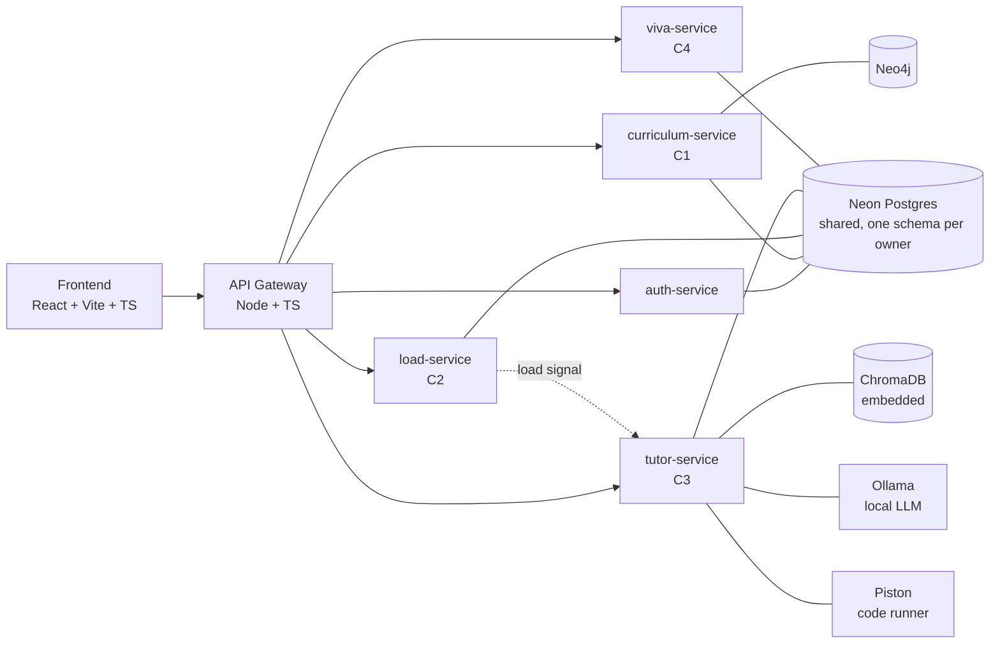

# AdaptLearn Monorepo Architecture and C3 Implementation Plan

**Project:** AdaptLearn (J26-IT-360)
**Scope of this document:** repository layout for all four components, the database strategy, the conventions that let four people work in one repo without collisions, and the build plan for Component 3 (VeriTutor).

---

## 1. Architecture at a Glance



**Core rules of the architecture**

1. **One service per component.** Each member owns exactly one service directory and one frontend feature directory. Nobody edits another member's service.
2. **The browser only talks to the gateway.** The gateway verifies the JWT, then forwards the request with `X-User-Id` and `X-User-Role` headers. Services trust these headers and never parse JWTs themselves.
3. **One shared Postgres database, one schema per owner.** Shared reference data (users, modules, topics, concepts) lives in a common schema everyone reads. Each service writes only to its own schema. Details in Section 4.
4. **Other services read your data through views, never raw tables.** A view is the contract. You can restructure your own tables freely as long as your published views keep their shape.
5. **Specialised stores stay private to their service.** C3 owns ChromaDB, C1 owns Neo4j. Nobody else connects to them.
6. **Real-time signals use APIs; reference and history data use views.** Only the C2 load signal is pushed over HTTP. Everything else is read from the shared database.
7. **Integrations are switchable.** Every cross-component read or call has a stub and a live implementation, selected by `INTEGRATION_MODE=stub|live`. Everyone develops against stubs, so no member is blocked waiting for another.
8. **No Docker required.** Every service runs natively with its own dependencies. Docker can be introduced later for deployment without changing the code.

---

## 2. Technology Choices

| Layer | Choice | Reason |
|---|---|---|
| Frontend | React 18, Vite, TypeScript, React Router, TanStack Query, Tailwind, shadcn/ui | Fast dev server, typed API calls, server-state caching without boilerplate |
| API gateway | Node.js, TypeScript, Fastify, `@fastify/http-proxy` | Thin routing and auth layer; same language as the frontend |
| Domain services | Python 3.11, FastAPI, Pydantic v2 | All four components are ML-heavy; one backend language keeps the service template shared |
| Python tooling | uv, ruff, pytest | Fast installs, pinned Python version per service, one linter/formatter |
| JS tooling | pnpm workspaces | Frontend and gateway share one lockfile and install |
| Shared database | Neon Postgres | Cloud hosted, nothing to install; per-member branches isolate development |
| DB access and migrations | SQLAlchemy 2, psycopg 3, Alembic | Each service migrates only its own schema with its own version table |
| Vector store (C3 only) | ChromaDB in embedded mode | `PersistentClient` runs inside the tutor-service process; no server to install |
| Graph store (C1 only) | Neo4j Aura free tier or Neo4j Desktop | C1's choice; private to curriculum-service |
| Local LLM (C3 only) | Ollama, native install | Offline fallback provider |
| Code execution (C3 only) | Piston | Sandboxed execution for student code practicals. The only component that needs Docker, and only from phase P4. Never run student code inside the tutor service |
| CI | GitHub Actions with path filters | A change to C3 only triggers C3's pipeline |

---

## 3. Repository Structure

Seven top-level directories. Folders are created when code goes into them, so the tree stays readable rather than being pre-filled with empty placeholders. Anything private to a single service lives inside that service.

```text
adaptlearn/
├── .github/
│   ├── workflows/                       # one path-filtered workflow per service
│   ├── CODEOWNERS
│   └── pull_request_template.md
│
├── frontend/                            # single React app, feature-sliced (Section 6)
│
├── backend/
│   └── services/
│       ├── api-gateway/                 # Node + TS, shared, owned by leader
│       ├── auth-service/                # FastAPI, shared, owned by leader
│       ├── _service-template/           # the reference shape; copy it to start a service
│       ├── curriculum-service/          # C1 Adaptive Curriculum Engine
│       ├── load-service/                # C2 Cognitive Load Detection
│       ├── tutor-service/               # C3 VeriTutor
│       │   ├── content/                 # authored Markdown units
│       │   ├── piston/                  # C3-only code runner, from P4. The one Docker use
│       │   └── .chroma/                 # embedded vector store, gitignored
│       └── viva-service/                # C4 Intelligent Viva System
│
├── database/                            # shared database setup, owned by leader
│   ├── core/
│   │   ├── alembic.ini
│   │   └── migrations/                  # core schema only: users, modules, topics, concepts
│   ├── roles.sql                        # one Postgres role per service, write grants on own schema
│   ├── schemas.sql                      # creates core, content, tutor, curriculum, load, viva
│   ├── seed/
│   │   ├── concepts_programming.csv     # jointly agreed concept list, prog.*
│   │   └── concepts_dsa.csv             # jointly agreed concept list, dsa.*
│   └── README.md                        # the rules in Section 4
│
├── contracts/                           # what crosses a component boundary
│   ├── views/                           # documented shape of every published view
│   │   ├── content.v_unit_manifest.md
│   │   ├── content.v_verified_passages.md
│   │   ├── tutor.v_attempt_outcomes.md
│   │   ├── curriculum.v_mastery.md
│   │   └── curriculum.v_next_topic.md
│   ├── schemas/
│   │   └── load-signal.schema.json      # the one pushed API payload, C2 -> C3
│   └── README.md
│
├── research/                            # experiments, never part of a running service
│   ├── c1-curriculum/
│   ├── c2-load/
│   ├── c3-veritutor/
│   └── c4-viva/
│
├── docs/
│   ├── architecture.md                  # this document
│   ├── onboarding.md                    # start here as a new member
│   ├── adr/                             # architecture decision records
│   │   ├── 0001-monorepo-microservices.md
│   │   ├── 0002-shared-postgres-schema-per-owner.md
│   │   └── 0003-no-docker-for-development.md
│   └── c3/                              # per-component design docs
│
├── pnpm-workspace.yaml
├── package.json
├── .editorconfig
├── .gitattributes
├── .pre-commit-config.yaml
├── .gitignore
└── README.md
```

**What the support folders are for**

| Folder | Purpose |
|---|---|
| `database/` | Creates the shared schemas and service roles, and migrates the `core` schema. Each service's own schema is migrated from inside that service |
| `contracts/` | The agreed shape of every view and pushed payload that crosses a component boundary |
| `research/` | Notebooks, labelling tools, datasets and experiment scripts, kept out of service code |
| `docs/` | Architecture, onboarding guide, and decision records that also feed the proposal's Decision Log appendix |

**What is deliberately absent**

| Not here | Why |
|---|---|
| A central env file | Every variable is documented in the `.env.example` of the service that reads it. One source per variable, so nothing drifts |
| Hand-written OpenAPI specs | FastAPI generates OpenAPI from the code. The frontend generates its types from a running service with `pnpm gen:types:<service>` into `frontend/src/shared/api/generated/` |
| A contracts changelog | The PR history is the changelog. CODEOWNERS already forces consumer approval on a contract change |
| Service-scaffolding scripts | The five services are created once, in P0, by copying `_service-template` and renaming four things. A script for a job done once is dead code |
| A root `infra/` folder | Nothing in this project is shared infrastructure. C3's Piston runner and vector store are private to tutor-service and live inside it |
| Empty placeholder folders | A service's internal shape is documented once in `_service-template` and in Section 5. Create folders when you have code for them |

---

### 4.3 Concept IDs

Concept IDs are the join key between content and the graph, so they are defined once in `core.concepts`, seeded from `database/seed/concepts.csv`, and agreed jointly.

- C1 owns the **prerequisite relationships** between concepts, stored in Neo4j.
- C3 owns **which units and practicals cover which concepts**, stored in `content`.
- Nobody invents a concept ID locally. New concepts are added through a PR to the seed file.

### 4.4 Example flow

1. C3 authors units as Markdown in the repo.
2. C3's ingestion pipeline embeds the chunks into ChromaDB and writes module, topic, unit and concept-tag rows into `content`.
3. C1 reads `content.v_unit_manifest`, builds nodes and prerequisite edges in Neo4j, and writes mastery into `curriculum`.
4. C3 reads `curriculum.v_mastery` and `curriculum.v_next_topic` to decide unlocks and the next session.
5. C1 reads `tutor.v_attempt_outcomes` as evidence for its mastery model.
6. C4 reads `content.v_verified_passages` to ground its viva question bank.

No service-to-service API calls are needed for any of these steps.

---

## 5. Backend Service Template

Every Python service follows the same internal shape so any member can read any service. This is what lives in `_service-template/`.

```text
<name>-service/
├── app/
│   ├── main.py                  # FastAPI app factory, router registration
│   ├── config.py                # pydantic-settings, reads .env
│   ├── api/
│   │   └── v1/
│   │       ├── router.py
│   │       └── routes/
│   │           └── health.py    # GET /health, required for every service
│   ├── core/
│   │   ├── logging.py
│   │   ├── errors.py            # shared error response format
│   │   └── deps.py              # current_user from gateway headers
│   ├── domain/                  # business logic, no FastAPI imports
│   ├── models/                  # Pydantic request/response schemas
│   ├── db/
│   │   ├── session.py           # SQLAlchemy engine using DATABASE_URL
│   │   ├── tables.py            # tables in this service's own schema
│   │   └── repositories/
│   └── integrations/            # cross-component readers and clients, stub + live
├── migrations/                  # Alembic, this service's schema only
├── alembic.ini
├── tests/
│   ├── unit/
│   └── integration/
├── .python-version              # pins Python 3.11
├── pyproject.toml
├── .env.example
└── README.md                    # what it does, env vars, how to run
```

**Conventions every service follows**

| Convention | Rule |
|---|---|
| Route prefix | `/api/v1/<service>`, e.g. `/api/v1/tutor/sessions` |
| Health check | `GET /health` returning `{"status": "ok"}` |
| Error format | `{"error": {"code": "...", "message": "...", "details": {}}}` |
| Auth | Read `X-User-Id` and `X-User-Role` via `core/deps.py` |
| Database schema | One schema named after the service's area: `content` and `tutor` for C3, `curriculum` for C1, `load` for C2, `viva` for C4 |
| Database role | `svc_<service>`, e.g. `svc_tutor` |
| Env var prefix | Service-specific vars prefixed, e.g. `TUTOR_`, `CURRICULUM_` |
| Logging | JSON logs with `request_id` propagated from the gateway |

### Local setup for any service

```bash
cd backend/services/tutor-service
uv sync                                   # installs the pinned Python and dependencies
cp .env.example .env                      # paste your Neon branch connection string
uv run alembic upgrade head               # migrates this service's schema only
uv run uvicorn app.main:app --reload --port 8301
```

### Ports and routes

| Service | Owner | Port | Gateway route |
|---|---|---|---|
| frontend | shared | 5173 | n/a |
| api-gateway | leader | 8080 | n/a |
| auth-service | leader | 8001 | `/api/v1/auth/*` |
| curriculum-service | C1 | 8101 | `/api/v1/curriculum/*` |
| load-service | C2 | 8201 | `/api/v1/load/*` |
| tutor-service | C3 | 8301 | `/api/v1/tutor/*` |
| viva-service | C4 | 8401 | `/api/v1/viva/*` |
| Neon Postgres | shared | cloud | n/a |
| Neo4j | C1 | cloud or local | n/a |
| Ollama | C3 | 11434 | n/a |
| Piston | C3 | 2000 | n/a |

---

## 6. Frontend Structure

One React app, split by feature. Each member owns one folder under `features/`.

```text
frontend/
├── src/
│   ├── app/
│   │   ├── App.tsx
│   │   ├── router.tsx           # mounts each feature's routes.tsx
│   │   ├── providers.tsx        # QueryClient, Auth, Theme
│   │   └── layouts/
│   │       ├── StudentLayout.tsx
│   │       └── InstructorLayout.tsx
│   ├── shared/                  # shared by everyone, changed via PR review
│   │   ├── api/
│   │   │   ├── client.ts        # fetch wrapper, attaches JWT, base URL = gateway
│   │   │   └── generated/       # TS types generated from a running service
│   │   ├── auth/
│   │   ├── components/ui/       # shadcn primitives
│   │   ├── hooks/
│   │   └── lib/
│   ├── features/
│   │   ├── auth/                # leader
│   │   ├── curriculum/          # C1
│   │   ├── cognitive-load/      # C2, includes in-browser webcam inference worker
│   │   ├── tutor/               # C3
│   │   └── viva/                # C4
│   └── main.tsx
├── public/
├── index.html
├── package.json
├── tsconfig.json
├── vite.config.ts               # dev proxy /api -> http://localhost:8080
└── .eslintrc.cjs                # boundary rules between features
```

**Inside every feature folder**

```text
features/tutor/
├── api/            # TanStack Query hooks calling /api/v1/tutor/*
├── components/
├── pages/
├── hooks/
├── store/          # feature-local state (Zustand) if needed
├── types/
├── routes.tsx      # route objects exported to app/router.tsx
└── index.ts        # the only file other features may import from
```

**Frontend rules**

- A feature never imports from another feature's internal files. Only through that feature's `index.ts`, or via `shared/`.
- Enforced with `eslint-plugin-boundaries`, so a violation fails CI rather than a code review.
- Each feature registers its own routes in `routes.tsx`. The only shared file members touch to add a feature is one line in `app/router.tsx`.

---

### Running only what you need

Nobody runs the whole platform locally. Each member runs three processes:

| Process | Command |
|---|---|
| Frontend | `pnpm --filter frontend dev` |
| Gateway | `pnpm --filter api-gateway dev` |
| Your own service | `uv run uvicorn app.main:app --reload --port <your port>` |

Requests to services that are not running return a clear 503 from the gateway. Your own service reads other components' data through stubs until the integration phase.

---

## 8. Cross-Component Contracts (v0)

Drafted now, implemented last. Each side builds against a stub until the integration phase.

| Contract | Producer | Consumer | Mechanism | Key fields |
|---|---|---|---|---|
| `content.v_unit_manifest` | C3 | C1 | View | `unit_id`, `module_id`, `topic_id`, `concept_ids`, `difficulty`, `practical_ids` |
| `content.v_verified_passages` | C3 | C4 | View | `passage_id`, `concept_id`, `text`, `source_unit_id`, `verified_at` |
| `tutor.v_attempt_outcomes` | C3 | C1 | View | `user_id`, `concept_id`, `item_id`, `correct`, `hints_used`, `attempted_at` |
| `curriculum.v_mastery` | C1 | C3 | View | `user_id`, `concept_id`, `mastery_score`, `updated_at` |
| `curriculum.v_next_topic` | C1 | C3 | View | `user_id`, `next_topic_id`, `weak_prerequisite_id` |
| `load-signal` | C2 | C3 | API push, POST to `tutor-service /internal/load` | `session_id`, `user_id`, `load_state` (low, moderate, high), `confidence`, `timestamp` |

The load signal is the only API contract because it is real-time and changes within a session. Internal endpoints live under `/internal/*` and are not exposed through the gateway.

---