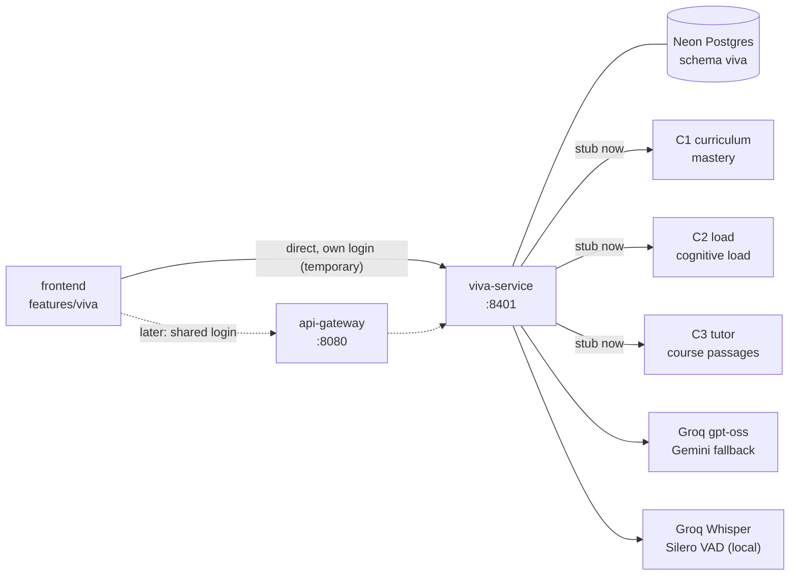
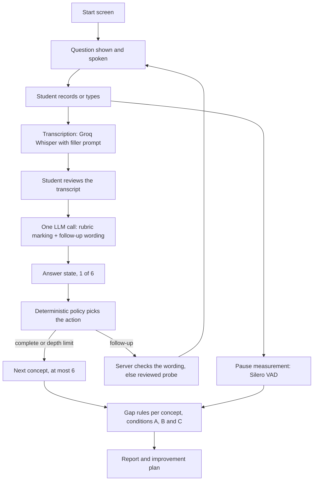

# C4 Intelligent Viva System: Architecture

| | |
|---|---|
| Component | C4 Intelligent Viva System (AdaptLearn, J26-IT-360) |
| Owner | R. J. Vanderheyden (IT23212022) |
| Service | `backend/services/viva-service` (FastAPI, Python 3.11, port 8401) |
| Frontend feature | `frontend/src/features/viva` (React, TypeScript), route `/viva` |
| Database | Neon Postgres, schema `viva`, role `svc_viva` |
| Rule versions | Policy `c04-policy-1.3-skip-stop`, gap rules `c04-gap-1.3-verbal-signal` |
| Status | Recreated from the standalone prototype on `feature-c4-viva-system`; not yet merged |

## 1. Purpose

A weak viva answer can mean the student lacks the knowledge, or knows it but struggles to explain
it. C4 runs a spoken technical viva and, for each concept, reports one of three conservative
outcomes:

| Outcome | Meaning |
|---|---|
| `LIKELY_KNOWLEDGE_GAP` | Key rubric points are still missing after follow-ups, or a misconception persists |
| `LIKELY_COMMUNICATION_DIFFICULTY` | The knowledge is shown, but expressing it was difficult |
| `MIXED_INSUFFICIENT_EVIDENCE` | Unclear or conflicting evidence, or no weakness to explain |

The research contribution is the combination of rubric assessment, a deterministic follow-up
policy and supplementary hesitation evidence. The language model never chooses the assessment
path; it only marks rubric points and words questions inside the purpose the policy selected.

## 2. Context in AdaptLearn



| Neighbour | Direction | Data | Current state |
|---|---|---|---|
| C1 Adaptive Curriculum | In | Mastery for raters and the mismatch flag | Mock (`app/integrations/context.py`) |
| C1 | Out | Review flag when a knowledge gap is found; C4 never changes mastery | Recorded in `viva.integration_events` |
| C2 Cognitive Load | In | High load reduces follow-ups from 2 to 1; never used in the gap rules | Mock |
| C3 AI Tutoring | In | Course content to ground questions | Mock notes and local course upload |

Target integration follows `docs/architecture.md`: read `curriculum.v_mastery` and
`content.v_verified_passages` through views behind `INTEGRATION_MODE=stub|live`, and publish a
`viva.v_review_flags` view for C1. These need contracts PRs.

## 3. Session flow



Students can skip a question, replay it, switch to typing, or say "stop the session".
Every turn stores its answer, state, action, wording source and rule versions for audit.

## 4. Backend layout

```text
backend/services/viva-service/
├── app/
│   ├── main.py                     # app factory, budgets middleware, CORS, error handlers
│   ├── config.py                   # Settings (VIVA_ prefix + shared names)
│   ├── api/v1/router.py
│   ├── api/v1/routes/              # auth, topics, sessions, speech, courses, bank, evaluation, health
│   ├── core/                       # auth (temporary local login), errors, logging, limits
│   ├── domain/                     # logic (states, policy, hesitation, gap rules, report),
│   │                               # disfluency, research (A/B/C metrics), seed (demo bank)
│   ├── integrations/               # llm, speech, context (C1 to C3), notifications, semantic
│   ├── db/                         # tables (viva schema), session (engine), repositories/materials
│   └── models/schemas.py           # Pydantic request and response models
├── migrations/                     # Alembic, version table inside viva
├── tests/unit/  tests/integration/
├── pyproject.toml  .python-version  .env.example  README.md
```

| Layer | Responsibility | Rule |
|---|---|---|
| `api` | HTTP, auth dependencies, persistence of session state | Thin; calls domain and integrations |
| `domain` | Research rules and report building | No network calls; pure and unit tested |
| `integrations` | LLM, speech, other components | Every external call is mocked in tests |
| `db` | Tables and engine | Writes only to the `viva` schema |

## 5. Key design decisions

| Decision | Reason |
|---|---|
| Deterministic follow-up policy | Comparable, auditable sessions; required by the research design |
| Single LLM call for marking and wording | Keeps answer turnaround near 2 to 3 seconds |
| Server re-validates every model output | Rubric IDs constrained by schema, coverage recomputed, wording checked for leaks and anchoring |
| Provider chain with cooldown | Groq `gpt-oss-120b`, then `gpt-oss-20b`, then Gemini; a 429 or 5xx moves on immediately |
| Hesitation needs two signals, one of them verbal | Timing alone produced false communication results in testing (6 Oct 2026) |
| Sessions snapshot their questions | Later bank edits never change a recorded session |
| Compare-and-swap session saves, idempotent `request_id` | Safe retries and concurrent requests |
| Temporary own login | Kept at the owner's request until the shared gateway login is adopted |

## 6. Data model (schema `viva`)

| Table | Purpose |
|---|---|
| `generated_question_bank` | Bank items: question, reference answer, rubric points with probes, misconceptions, follow-ups, sources, review status |
| `viva_sessions` | Session JSON (snapshots, turns, current question, context, report) with a version column |
| `viva_turns` | One row per answer, unique per request and per question |
| `viva_results` | Final report per session |
| `integration_events` | C1 review flags and delivery status |
| `human_ratings` | Blinded rater labels per case and condition |
| `usage_counters` | Atomic LLM and speech budgets |
| `courses`, `course_materials` | Locally uploaded course material (until C3 passages are live) |
| `users`, `auth_tokens` | Temporary local login |

## 7. Evaluation architecture

Each completed concept becomes a blinded rater case under three evidence conditions: A (first
answer only), B (all answers), C (all answers plus hesitation). Predictions for all three are
computed from the same recorded turns. Metrics: accuracy, macro F1 and Cohen's kappa against two
human raters, plus inter-rater kappa. See `docs/c4/spec-domain.md` section 9 and
`research/c4-viva/README.md`.

## 8. Security and privacy

- Secrets live only in `backend/services/viva-service/.env`, which git ignores.
- Cloud processing (Groq, Gemini) requires `VIVA_ALLOW_CLOUD_LLM=true`; audio and transcripts are sent to Groq for transcription.
- Audio is processed in memory and not stored.
- Rater exports are pseudonymised.
- The temporary login must not be used for a real study; adopt the shared login first.

## 9. Related documents

| Document | Contents |
|---|---|
| [README.md](README.md) | Index of the C4 docs |
| [spec-domain.md](spec-domain.md), [spec-backend.md](spec-backend.md), [spec-frontend.md](spec-frontend.md) | Detailed behaviour specifications |
| [TODO.md](TODO.md) | Open work, by priority |
| [migration-plan.md](migration-plan.md) | Recreation checklist and log |
| [handover.md](handover.md) | Research proposal context |
| [SKILL.md](SKILL.md) | Working guide for AI assistants on C4 |
